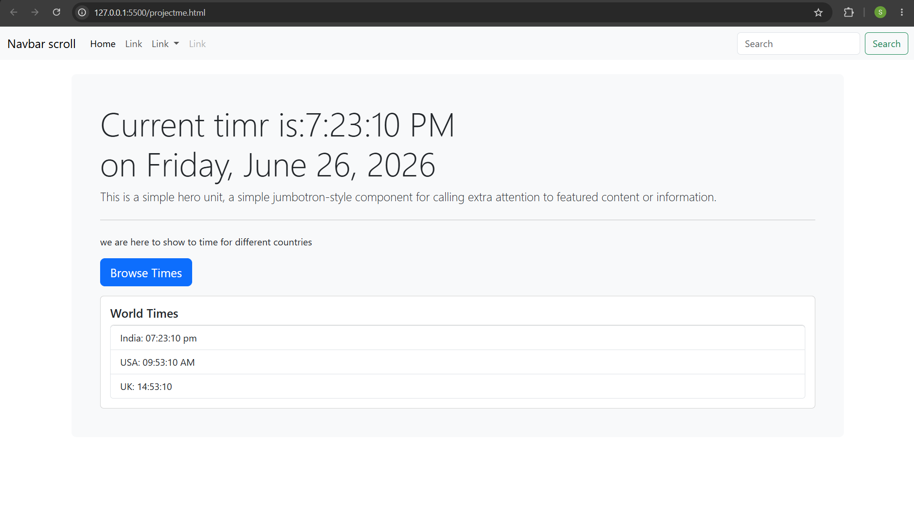

# World Clock Application

A responsive world clock application built using HTML, Bootstrap 5, and JavaScript.

## Features
- Live local time display
- Current date display
- World clocks:
  - India
  - USA
  - United Kingdom
- Bootstrap collapse component
- Responsive design

## Technologies Used
- HTML5
- Bootstrap 5
- JavaScript

## Screenshot

## Author
Soumyaranjan Prusty

